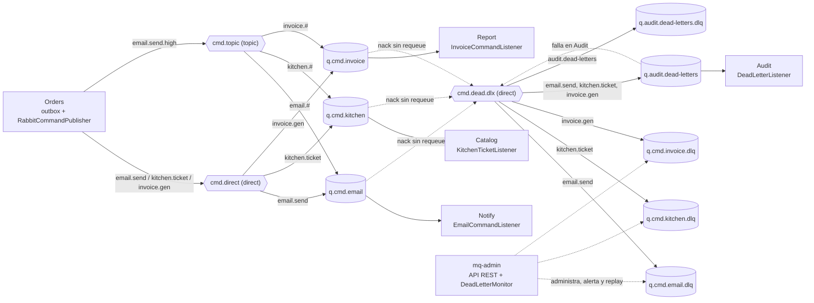

# RabbitMQ en Pedidos360 (EP3 DSY1107)

Documento central de la mensajería asíncrona: topología, contrato de mensajes, manejo de errores (ACK, NACK, reintentos y DLQ), microservicio administrador, despliegue local y guion de demostración. La fuente de verdad compartida por los servicios es el contrato descrito aquí; cualquier cambio de nombres o argumentos debe hacerse en todos los productores y consumidores a la vez.

## 1. Objetivo y alcance

La EP3 pide incorporar RabbitMQ con colas, exchanges y DLQ para tareas asíncronas (notificaciones, tickets, documentos), demostrar que la mensajería desacoplada funciona **sin afectar la lógica existente** y contar con un microservicio administrador de colas, exchanges y bindings.

| Tarea asíncrona | Productor | Cola | Consumidor | Efecto |
|---|---|---|---|---|
| Correo de cambio de estado | Orders | `q.cmd.email` | Notify | Envía el correo por SMTP (Mailpit en local) |
| Ticket de cocina | Orders (al aceptar) | `q.cmd.kitchen` | Catalog | Genera el ticket con los nombres de producto (`kitchen_tickets`) |
| Boleta | Orders (al entregar) | `q.cmd.invoice` | Report | Genera la boleta con neto e IVA (`report_invoices`) |
| Auditoría de fallos | RabbitMQ (DLX) | `q.audit.dead-letters` | Audit | Registra cada dead letter (`audit_dead_letters`) |
| Administración | ADMIN por REST | — | mq-admin | Crea/elimina colas, exchanges y bindings; vigila y reprocesa DLQ |

Principios:

- **Sin acoplamiento temporal.** Orders guarda el pedido y sus comandos en la misma transacción (outbox `notification_outbox`); un publicador los envía después. Si RabbitMQ o un consumidor están caídos, los pedidos se siguen creando y cambiando de estado.
- **La lógica previa no cambia.** Rutas HTTP, estados de pedidos, stock, Kafka, BFF y frontend siguen igual. Catalog, Report y Audit solo se conectan al broker si su interruptor está activo (`compose.commands.yml`); con el interruptor apagado no crean beans de mensajería y sus pruebas no necesitan RabbitMQ.
- **Ningún mensaje se pierde en silencio.** Confirmaciones del publicador, ACK manual en consumidores, DLQ con retención de 7 días, auditoría, alertas y reproceso controlado.

Ajustes documentados respecto de la "Topología RabbitMQ (ejemplo)" del caso: los patrones topic usan `#` (`email.#`) porque el ejemplo `email.send.high` tiene tres segmentos y `email.*` no lo enrutaría, y se agrega una cola de auditoría de dead letters.

## 2. Topología

Broker: `rabbitmq:4.3.5-management-alpine`, vhost `pedidos360`, un nodo. Exchanges durables, sin autoeliminación ni argumentos.

| Exchange | Tipo | Uso |
|---|---|---|
| `cmd.direct` | direct | Comandos normales: `email.send`, `kitchen.ticket`, `invoice.gen` |
| `cmd.topic` | topic | Comandos por patrón; Orders publica `email.send.high` (cancelaciones, prioridad) |
| `cmd.dead.dlx` | direct | Dead letter exchange: recibe lo rechazado por los consumidores |

| Cola | Argumentos | Bindings | Consumidor |
|---|---|---|---|
| `q.cmd.email` | DLX `cmd.dead.dlx`, DLRK `email.send`, `x-max-length` 10000, `x-overflow` reject-publish | `cmd.direct[email.send]`, `cmd.topic[email.#]` | Notify |
| `q.cmd.kitchen` | DLX `cmd.dead.dlx`, DLRK `kitchen.ticket`, 10000, reject-publish | `cmd.direct[kitchen.ticket]`, `cmd.topic[kitchen.#]` | Catalog |
| `q.cmd.invoice` | DLX `cmd.dead.dlx`, DLRK `invoice.gen`, 10000, reject-publish | `cmd.direct[invoice.gen]`, `cmd.topic[invoice.#]` | Report |
| `q.cmd.email.dlq` | `x-message-ttl` 604800000 (7 días), `x-max-length` 10000 | `cmd.dead.dlx[email.send]` | — (inspección y replay) |
| `q.cmd.kitchen.dlq` | 7 días, 10000 | `cmd.dead.dlx[kitchen.ticket]` | — |
| `q.cmd.invoice.dlq` | 7 días, 10000 | `cmd.dead.dlx[invoice.gen]` | — |
| `q.audit.dead-letters` | DLX `cmd.dead.dlx`, DLRK `audit.dead-letters`, 10000 | `cmd.dead.dlx[email.send]`, `[kitchen.ticket]`, `[invoice.gen]` (copia) | Audit |
| `q.audit.dead-letters.dlq` | 7 días, 10000 | `cmd.dead.dlx[audit.dead-letters]` | — |



Quién declara qué (cada declaración es un `@Bean` individual de `Queue`, `Exchange` o `Binding` en `config/RabbitTopologyConfig`, con Javadoc que documenta la ruta; RabbitAdmin los declara al conectar):

- **Orders** (productor): los 3 exchanges, las 6 colas `q.cmd.*` y sus 9 bindings, para que un comando no se pierda aunque su consumidor aún no haya arrancado.
- **Notify / Catalog / Report**: los 3 exchanges, su cola, su DLQ y sus 3 bindings.
- **Audit**: `cmd.dead.dlx`, `q.audit.dead-letters`, `q.audit.dead-letters.dlq` y sus 4 bindings.
- **mq-admin**: no declara topología propia; la administra por API.

Los argumentos deben ser idénticos en valor **y tipo** en todos los servicios (`x-max-length` Long, `x-message-ttl` Integer); si difieren, RabbitMQ responde `406 PRECONDITION_FAILED`.

## 3. Propiedades centralizadas

Ningún nombre de cola, exchange o routing key está escrito en clases de negocio, listeners o publicadores: viven en `application.properties` y se enlazan a un record validado `config/MessagingProperties` (`@ConfigurationProperties("messaging")`). Cada servicio incluye solo sus rutas.

```properties
messaging.exchanges.direct=cmd.direct
messaging.exchanges.topic=cmd.topic
messaging.exchanges.dead-letter=cmd.dead.dlx
messaging.routes.email.queue=${RABBITMQ_EMAIL_QUEUE:q.cmd.email}
messaging.routes.email.dlq=${RABBITMQ_EMAIL_DLQ:q.cmd.email.dlq}
messaging.routes.email.routing-key=email.send
messaging.routes.email.topic-pattern=email.#
messaging.routes.email.priority-routing-key=email.send.high   # solo Orders
messaging.routes.kitchen.queue=q.cmd.kitchen
messaging.routes.kitchen.dlq=q.cmd.kitchen.dlq
messaging.routes.kitchen.routing-key=kitchen.ticket
messaging.routes.kitchen.topic-pattern=kitchen.#
messaging.routes.invoice.queue=q.cmd.invoice
messaging.routes.invoice.dlq=q.cmd.invoice.dlq
messaging.routes.invoice.routing-key=invoice.gen
messaging.routes.invoice.topic-pattern=invoice.#
messaging.queues.max-length=10000
messaging.queues.dead-letter-ttl=7d
messaging.queues.dead-letter-max-length=10000
```

Consumidores (Notify, Catalog, Report, Audit):

```properties
spring.rabbitmq.listener.simple.acknowledge-mode=manual
spring.rabbitmq.listener.simple.prefetch=1
spring.rabbitmq.listener.simple.default-requeue-rejected=false
spring.rabbitmq.listener.simple.retry.enabled=false
messaging.consumer.prefetch=1
messaging.consumer.max-payload-bytes=8192   # Notify; Catalog y Report 32768; Audit 65536
messaging.consumer.retry.max-attempts=3
messaging.consumer.retry.initial-interval=1s
messaging.consumer.retry.multiplier=2
messaging.consumer.retry.max-interval=4s
```

Conexión, en todos los servicios, solo por variables de entorno: `RABBITMQ_HOST`, `RABBITMQ_PORT`, `RABBITMQ_USERNAME`, `RABBITMQ_PASSWORD`, `RABBITMQ_VHOST` (por defecto `pedidos360`). No hay credenciales en código ni en properties.

Interruptores:

| Servicio | Propiedad | Variable | Por defecto |
|---|---|---|---|
| Orders | `orders.notifications.enabled` | `ORDERS_NOTIFICATIONS_ENABLED` | `false` (Compose: `true`) — publica los 4 tipos de comando |
| Orders | `orders.notifications.max-attempts` | `ORDERS_NOTIFICATIONS_MAX_ATTEMPTS` | `20` intentos de publicación por registro |
| Catalog | `catalog.commands.enabled` | `CATALOG_COMMANDS_ENABLED` | `false` (Compose con `compose.commands.yml`: `true`) |
| Report | `report.commands.enabled` | `REPORT_COMMANDS_ENABLED` | `false` (ídem) |
| Audit | `audit.dead-letters.enabled` | `AUDIT_DEAD_LETTERS_ENABLED` | `false` (ídem) |

Notify siempre consume. Catalog, Report y Audit fijan `management.health.rabbit.enabled=false`: su API HTTP no depende del broker. Notify y mq-admin incluyen RabbitMQ en su readiness.

## 4. Envelope y payloads

Propiedades AMQP que fija Orders en cada mensaje:

| Propiedad | Valor |
|---|---|
| `messageId` | `eventId` (UUID) del payload; base de la idempotencia |
| `type` | Routing key usada: `email.send`, `email.send.high`, `kitchen.ticket` o `invoice.gen` |
| `correlationId` | `order-<orderId>` |
| `timestamp` | `occurredAt` del payload |
| `appId` | `ms-pedidos360-orders` |
| `contentType` / `contentEncoding` | `application/json` / `UTF-8` |
| `deliveryMode` | PERSISTENT |
| header `x-trace-id` | `traceId` del payload |
| header `x-schema-version` | `1` (Integer) |

Payloads JSON v1 (camelCase; los consumidores rechazan propiedades desconocidas):

```json
{"schemaVersion":1,"eventId":"6f1c3f0e-8a4b-4c1e-9a43-2a7d1e5b9c10","orderId":42,"customerId":"cliente-demo","status":"ACEPTADO","occurredAt":"2026-10-08T15:30:00Z","traceId":"trace-demo-001"}
```

```json
{"schemaVersion":1,"eventId":"0b2f6a55-3f0f-4f61-b3a8-7e7d64d0f0a1","orderId":42,"customerId":"cliente-demo","items":[{"productId":7,"quantity":2},{"productId":9,"quantity":1}],"occurredAt":"2026-10-08T15:30:00Z","traceId":"trace-demo-001"}
```

```json
{"schemaVersion":1,"eventId":"9d0c8e1a-1b2c-4d3e-8f4a-5b6c7d8e9f00","orderId":42,"customerId":"cliente-demo","items":[{"productId":7,"quantity":2,"unitPrice":1500.00},{"productId":9,"quantity":1,"unitPrice":2990.00}],"total":5990.00,"occurredAt":"2026-10-08T18:00:00Z","traceId":"trace-demo-001"}
```

Los tres corresponden a `EmailCommand` (`email.send` / `email.send.high`), `KitchenTicketCommand` (`kitchen.ticket`) e `InvoiceCommand` (`invoice.gen`). Validación en consumidores: `schemaVersion == 1`; `eventId` no nulo; `orderId > 0`; `customerId` no vacío (máx. 200); `items` 1..50 con `productId > 0` y `quantity > 0`; `unitPrice > 0` con máx. 2 decimales; `total > 0`; `occurredAt` no nulo; `traceId` `[A-Za-z0-9._-]{1,100}`. Si `messageId` viene y difiere de `eventId`, el mensaje es inválido.

## 5. Cuándo publica Orders

Outbox transaccional existente (`notification_outbox`, columna `command_type`). `service/OrderCommandPolicy` aplica la regla; `messaging/CommandOutbox` guarda los registros en la misma transacción del pedido; `messaging/OutboxPublisher` los publica con publisher confirms y `mandatory` (reintento con espera creciente hasta `ORDERS_NOTIFICATIONS_MAX_ATTEMPTS`).

| Evento del pedido | Comandos (`CommandType`) | Exchange / routing key |
|---|---|---|
| Creación y cualquier cambio de estado | `EMAIL` | `cmd.direct` / `email.send` |
| Cambio a `CANCELADO` | `EMAIL_PRIORITY` (en lugar de `EMAIL`) | `cmd.topic` / `email.send.high` |
| Cambio a `ACEPTADO` | `EMAIL` + `KITCHEN_TICKET` | `cmd.direct` / `kitchen.ticket` |
| Cambio a `ENTREGADO` | `EMAIL` + `INVOICE` | `cmd.direct` / `invoice.gen` |

Si la cola de destino está llena (`reject-publish`), el broker responde nack y Orders reintenta más tarde: el comando sigue en el outbox.

## 6. Decisiones ACK / NACK / reintentos / DLQ

Todos los consumidores usan `AcknowledgeMode.MANUAL` (`config/RabbitListenerConfig`, bean `manualAckContainerFactory`, prefetch 1, `defaultRequeueRejected=false`, sin retry interceptor) y la misma tabla, implementada en `messaging/support/ManualAckHandler`:

| Situación | Acción | Log |
|---|---|---|
| Procesado OK | `channel.basicAck(tag, false)` | INFO `[ACK]` |
| Duplicado (`eventId` ya procesado) | `basicAck` sin repetir efectos (idempotencia) | INFO `[ACK] Duplicado` |
| Inválido o veneno: content-type, tamaño, JSON, validación, `messageId != eventId`, regla de negocio imposible (`InvalidMessageException`) | `basicNack(tag, false, false)` inmediato -> DLX -> DLQ | WARN `[DLQ]` con cola, messageId y motivo |
| Error transitorio (SMTP, base de datos, otra excepción) | Reintento local acotado: 3 intentos en total, con esperas de 1 s y luego 2 s (backoff exponencial, tope 4 s); si se agota, `basicNack(tag, false, false)` -> DLQ | WARN `[RETRY]` por intento; ERROR `[DLQ]` con la excepción |
| Nunca | `basicNack(..., requeue=true)` | Evita bucles infinitos de mensajes veneno |

Ninguna excepción escapa del listener: siempre se ejecuta ACK o NACK. Si el canal se cerró antes de confirmar, se registra ERROR; RabbitMQ reentrega el mensaje y la idempotencia por `eventId` evita efectos duplicados (Notify, que no tiene base de datos, usa un registro en memoria acotado).

Listeners por dominio (`@RabbitListener(id = ..., queues = "${messaging.routes.<ruta>.queue}", containerFactory = "manualAckContainerFactory")`, firma `onMessage(Message, Channel, @Header(AmqpHeaders.DELIVERY_TAG) long)`):

| Servicio | Listener | Servicio de negocio |
|---|---|---|
| Notify | `messaging/email/EmailCommandListener` | `service/EmailService` |
| Catalog | `messaging/kitchen/KitchenTicketListener` | `service/KitchenTicketService` |
| Report | `messaging/invoice/InvoiceCommandListener` | `service/InvoiceService` |
| Audit | `messaging/deadletter/DeadLetterListener` | `service/DeadLetterStore` |

## 7. Retención y alertas

- Colas principales: `x-max-length` 10000 con `x-overflow=reject-publish`. Al llenarse no se descartan mensajes: el publicador recibe nack y reintenta.
- DLQ: `x-message-ttl` de 7 días y `x-max-length` 10000. Los mensajes quedan disponibles para inspección y replay; pasados 7 días (o sobre 10000) RabbitMQ descarta los más antiguos.
- `DeadLetterMonitor` (mq-admin) revisa cada `MQ_ADMIN_ALERT_INTERVAL` (30 s) la profundidad de las 4 DLQ y escribe `WARN [ALERTA DLQ] cola=... mensajes=... umbral=...` cuando alcanzan `MQ_ADMIN_ALERT_THRESHOLD` (1, es decir, desde el primer mensaje). `GET /api/v1/mq-admin/dead-letter-queues` entrega lo mismo en JSON (`queue`, `exists`, `messages`, `threshold`, `alert`).

## 8. Auditoría de dead letters

`cmd.dead.dlx` entrega una copia de cada mensaje muerto en `q.audit.dead-letters`. Audit (`messaging/deadletter/DeadLetterListener` + `service/DeadLetterStore`) registra en `audit_dead_letters`: cola de origen, motivo, conteo, exchange y routing key originales (desde `x-death` o `x-first-death-*`), messageId, type, traceId y el payload (o su hash), y escribe un WARN. Consulta: `GET /api/v1/audit/dead-letters?afterId=&size=` (roles ADMIN o AUDITOR, con scope). Si Audit no puede registrar, el mensaje termina en `q.audit.dead-letters.dlq`.

## 9. Microservicio administrador (mq-admin, puerto 8086)

Base `/api/v1/mq-admin`, JWT con scope `pedidos360.access` y rol `ADMIN` (401 sin token, 403 con otro rol). Detalle, ejemplos con curl y variables en [su README](../ms-pedidos360-mq-admin/README.md); colección [Pedidos360-MQAdmin](../postman/Pedidos360-MQAdmin.postman_collection.json).

| Método | Ruta | Respuesta |
|---|---|---|
| GET | `/queues` | 200 lista (API HTTP de management) |
| GET | `/queues/{name}` | 200 (mensajes, consumidores) / 404 |
| POST | `/queues` | 201 + Location / 400 / 409 si ya existe |
| DELETE | `/queues/{name}?ifUnused=false&ifEmpty=false` | 204 / 404 / 409 (protegida o precondición) |
| DELETE | `/queues/{name}/messages` | 200 `{queue, purged}` |
| GET | `/exchanges` | 200 lista |
| POST | `/exchanges` | 201 / 400 / 409 |
| DELETE | `/exchanges/{name}?ifUnused=false` | 204 / 404 / 409 |
| GET | `/bindings?exchange=&queue=` | 200 lista |
| POST | `/bindings` | 201 / 400 / 404 / 409 |
| DELETE | `/bindings?exchange=&queue=&routingKey=` | 204 / 404 |
| GET | `/dead-letter-queues` | 200 profundidad, umbral y alerta por DLQ |
| POST | `/dead-letter-queues/{name}/replay` | 200 `{replayed, failed}` |

Diseño: los controladores (`controller/*AdminController`, `DeadLetterQueueController`) solo validan y llaman a `service/RabbitAdminService`; `RabbitAdminServiceImpl` hace las mutaciones con `RabbitAdmin`/`AmqpAdmin` y las lecturas con `client/RabbitManagementClient` (API HTTP de management, autenticación básica, vhost codificado, tiempos de 3 s). Los errores del broker se traducen a excepciones de dominio y `exception/GlobalExceptionHandler` las convierte en HTTP con el formato común.

Validaciones principales (400 con mensaje claro por campo): nombre obligatorio `^(?!amq\.)[A-Za-z0-9][A-Za-z0-9._-]{0,254}$`; tipo de cola `CLASSIC|QUORUM`; QUORUM exige `durable=true` y `autoDelete=false`; `durable=false` se rechaza (RabbitMQ 4.3 deniega colas transitorias); `deadLetterRoutingKey` exige `deadLetterExchange` (que debe existir); `messageTtlMs` 1..1209600000; `maxLength` 1..1000000; tipo de exchange obligatorio; routing key de binding con segmentos o comodines `*`/`#` separados por punto (comodines solo en exchanges topic); `maxMessages` 1..100; JSON mal formado, enum inválido o propiedad desconocida.

Reglas: crear algo existente o con un nombre de la topología base: 409. Eliminar o purgar algo inexistente: 404. Los 3 exchanges y las 8 colas del contrato están protegidos (`mqadmin.protected-resources`): no se eliminan (409). `406 PRECONDITION_FAILED` del broker: 409. Broker o management caídos: 503.

Replay (`POST /dead-letter-queues/{name}/replay`, solo DLQ configuradas): por cada mensaje `basicGet` sin auto-ack, republicación con publisher confirm y `mandatory` al exchange y routing key originales (`x-death[0].exchange` y `routing-keys[0]`; sin `x-death`, directo a `x-first-death-queue`) y recién entonces `basicAck`. Si no se puede republicar (sin destino, exchange inexistente, sin cola que lo reciba o sin confirmación), el mensaje vuelve a la DLQ con `basicNack(requeue=true)` y se cuenta en `failed`. El mensaje reenviado conserva `messageId` y headers de trazabilidad, sin `x-death*`, y agrega `x-replayed-from`.

## 10. Levantar con Docker Compose

Requisitos: Docker Desktop con contenedores Linux y un `.env` en la raíz (copiar `.env.example` y reemplazar marcadores; nunca subirlo a Git). Variables obligatorias para RabbitMQ: `RABBITMQ_USERNAME`, `RABBITMQ_PASSWORD`; para los servicios Java: `JWT_ISSUER_URI`, `JWT_AUDIENCE` y las contraseñas de PostgreSQL (`POSTGRES_ADMIN_PASSWORD`, `CATALOG_DB_PASSWORD`, `ORDERS_DB_PASSWORD`, `AUDIT_DB_PASSWORD`, `REPORT_DB_PASSWORD`).

| Archivo | Aporta |
|---|---|
| `compose.postgres.yml` | PostgreSQL de Catalog (proyecto `pedidos360-local`, igual que `compose.rabbitmq.yml`) |
| `compose.catalog.yml` | Catalog y BFF |
| `compose.orders.yml` | Orders y su PostgreSQL |
| `compose.rabbitmq.yml` | **RabbitMQ y mq-admin**; se puede levantar solo |
| `compose.notify.yml` | Notify, Mailpit y la publicación de Orders (usar junto a `compose.rabbitmq.yml`) |
| `compose.kafka.yml` | Kafka KRaft y el inicializador del tópico |
| `compose.audit.yml` / `compose.report.yml` | Audit y Report con sus bases |
| `compose.commands.yml` | Activa los consumidores RabbitMQ de Catalog, Report y Audit |

Solución completa (PowerShell, desde la raíz; el orden de los `-f` importa):

```powershell
Set-Location -LiteralPath 'D:\Cloud_Native_EVA'
docker compose -f compose.postgres.yml -f compose.catalog.yml -f compose.orders.yml -f compose.rabbitmq.yml -f compose.notify.yml -f compose.kafka.yml -f compose.audit.yml -f compose.report.yml -f compose.commands.yml up -d --build
docker compose -f compose.postgres.yml -f compose.catalog.yml -f compose.orders.yml -f compose.rabbitmq.yml -f compose.notify.yml -f compose.kafka.yml -f compose.audit.yml -f compose.report.yml -f compose.commands.yml ps
```

Son 15 servicios: 14 contenedores activos y el inicializador de Kafka, que termina con código 0.

Solo RabbitMQ y mq-admin:

```powershell
docker compose -f compose.rabbitmq.yml up -d --build
Invoke-RestMethod http://localhost:8086/actuator/health/readiness
```

Detener sin borrar datos: el mismo comando con `stop`. No usar `down -v` en desarrollo: borra colas, bases y buzón.

| Dirección local | Uso |
|---|---|
| `http://localhost:15672` | Consola de RabbitMQ (usuario y clave de `.env`) |
| `http://localhost:8086` | mq-admin |
| `http://localhost:8025` | Mailpit (correos) |
| `http://localhost:8080` | BFF |
| `http://localhost:8082` / `8084` / `8085` | Catalog / Report / Audit (también validan el JWT) |

Todos los puertos se publican solo en `127.0.0.1`.

## 11. Guion de demostración

Preparación: solución completa levantada, Access Tokens reales de Entra en variables de PowerShell (`$cliente`, `$operador`, `$admin`; ver [Orders](ORDERS_COMPLETO.md) y las colecciones Postman) y un producto con stock (por ejemplo `id` 1).

```powershell
function Api($method, $url, $token, $body) {
  $params = @{ Method = $method; Uri = $url; Headers = @{ Authorization = "Bearer $token" } }
  if ($body) { $params.ContentType = 'application/json'; $params.Body = ($body | ConvertTo-Json -Depth 5) }
  Invoke-RestMethod @params
}
$compose = '-f','compose.postgres.yml','-f','compose.catalog.yml','-f','compose.orders.yml','-f','compose.rabbitmq.yml','-f','compose.notify.yml','-f','compose.kafka.yml','-f','compose.audit.yml','-f','compose.report.yml','-f','compose.commands.yml'
```

1. **Topología.** Abrir `http://localhost:15672` (Exchanges y Queues) o consultar mq-admin:
   `Api GET http://localhost:8086/api/v1/mq-admin/bindings?exchange=cmd.dead.dlx $admin`
2. **Crear pedido** (correo `CREADO`): `$p = Api POST http://localhost:8080/api/v1/orders $cliente @{ items = @(@{ productId = 1; quantity = 2 }) }`. Revisar Mailpit (`http://localhost:8025`).
3. **Aceptarlo** (correo + ticket de cocina): `Api PATCH "http://localhost:8080/api/v1/orders/$($p.id)/status" $operador @{ status = 'ACEPTADO' }`. Requiere la identidad técnica de Orders configurada en Entra para descontar stock ([Orders](ORDERS_COMPLETO.md)).
4. **Ver el ticket de cocina** generado por Catalog: `Api GET "http://localhost:8082/api/v1/catalog/kitchen-tickets/$($p.id)" $admin`.
5. **Entregarlo** (EN_PREPARACION -> DESPACHADO -> ENTREGADO; el último publica la boleta):
   `'EN_PREPARACION','DESPACHADO','ENTREGADO' | ForEach-Object { Api PATCH "http://localhost:8080/api/v1/orders/$($p.id)/status" $operador @{ status = $_ } }`
6. **Ver la boleta** generada por Report: `Api GET "http://localhost:8084/api/v1/reports/invoices/$($p.id)" $admin`.
7. **Cancelación prioritaria** (opcional): crear otro pedido y `Api POST "http://localhost:8080/api/v1/orders/<id>/cancel" $cliente`. El correo `CANCELADO` viaja por `cmd.topic` con `email.send.high`.
8. **Provocar un mensaje inválido.** En la consola de RabbitMQ: Exchanges -> `cmd.direct` -> Publish message, routing key `kitchen.ticket`, propiedad `content_type=application/json`, payload `{"schemaVersion":99}`. O por la API de management:

   ```powershell
   $basic = [Convert]::ToBase64String([Text.Encoding]::UTF8.GetBytes('<usuario-rabbit>:<clave-rabbit>'))
   $msg = @{ routing_key = 'kitchen.ticket'; payload = '{"schemaVersion":99}'; payload_encoding = 'string'
             properties = @{ content_type = 'application/json'; delivery_mode = 2; message_id = [guid]::NewGuid().ToString() } } | ConvertTo-Json -Depth 4
   Invoke-RestMethod -Method Post -Uri http://localhost:15672/api/exchanges/pedidos360/cmd.direct/publish -Headers @{ Authorization = "Basic $basic" } -ContentType 'application/json' -Body $msg
   ```
9. **Verlo en la DLQ, en logs y en Audit.**
   - Logs: `docker compose @compose logs catalog audit mq-admin | Select-String 'DLQ'` muestra `[DLQ] Mensaje inválido...` (Catalog), el registro de Audit y, en menos de 30 s, `[ALERTA DLQ] cola=q.cmd.kitchen.dlq mensajes=1 umbral=1` (mq-admin).
   - DLQ: `Api GET http://localhost:8086/api/v1/mq-admin/dead-letter-queues $admin` (`alert=true`) o la consola de RabbitMQ (`q.cmd.kitchen.dlq` con 1 mensaje, header `x-death` con `reason=rejected`).
   - Auditoría: `Api GET 'http://localhost:8085/api/v1/audit/dead-letters?size=10' $admin`.
10. **Crear y borrar recursos desde mq-admin** (también con la colección Postman):

    ```powershell
    $mq = 'http://localhost:8086/api/v1/mq-admin'
    Api POST "$mq/exchanges" $admin @{ name = 'ex.demo.ep3'; type = 'TOPIC' }
    Api POST "$mq/queues" $admin @{ name = 'q.demo.ep3'; deadLetterExchange = 'cmd.dead.dlx'; messageTtlMs = 60000; maxLength = 100 }
    Api POST "$mq/bindings" $admin @{ exchange = 'ex.demo.ep3'; queue = 'q.demo.ep3'; routingKey = 'demo.#' }
    Api GET "$mq/bindings?exchange=ex.demo.ep3" $admin
    Api POST "$mq/queues" $admin @{ name = '' }                   # 400: El nombre de la cola es obligatorio
    Api DELETE "$mq/queues/q.cmd.email" $admin                     # 409: topología base protegida
    Api DELETE "$mq/bindings?exchange=ex.demo.ep3&queue=q.demo.ep3&routingKey=demo.%23" $admin
    Api DELETE "$mq/queues/q.demo.ep3" $admin
    Api DELETE "$mq/exchanges/ex.demo.ep3?ifUnused=true" $admin
    ```
11. **Replay después de un fallo transitorio.** Pausar SMTP, generar un correo y esperar que Notify agote los reintentos:

    ```powershell
    docker compose @compose pause mailpit
    $q = Api POST http://localhost:8080/api/v1/orders $cliente @{ items = @(@{ productId = 1; quantity = 1 }) }
    # ~20 s: logs de Notify con [RETRY] 1/3, 2/3 y luego [DLQ] Reintentos agotados; q.cmd.email.dlq con 1 mensaje
    docker compose @compose unpause mailpit
    Api POST "$mq/dead-letter-queues/q.cmd.email.dlq/replay" $admin @{ maxMessages = 10 }   # {replayed: 1, failed: 0}
    ```

    El correo `CREADO` llega a Mailpit. Reprocesar el mensaje inválido del paso 8 lo devuelve a `q.cmd.kitchen`, Catalog lo vuelve a rechazar y regresa a la DLQ: el veneno no entra en un bucle. Para descartarlo después de revisarlo: `Api DELETE "$mq/queues/q.cmd.kitchen.dlq/messages" $admin`.

## 12. Nota de migración (volumen `rabbitmq_data` existente)

Hasta la EP2, Notify declaraba `q.cmd.email` con DLX por el exchange por defecto y `q.cmd.email.dlq` sin argumentos. Si el volumen `pedidos360-local_rabbitmq_data` ya existe, al iniciar la nueva topología RabbitMQ responde `406 PRECONDITION_FAILED - inequivalent arg ...` y Orders/Notify no arrancan su mensajería. Hay dos salidas (en desarrollo; los mensajes pendientes de esas colas se pierden). `$compose` es la lista de archivos definida en la sección 11:

```powershell
# Opción A: borrar solo las dos colas antiguas (mq-admin no lo permite porque están protegidas)
docker compose -f compose.rabbitmq.yml exec rabbitmq rabbitmqctl delete_queue --vhost pedidos360 q.cmd.email
docker compose -f compose.rabbitmq.yml exec rabbitmq rabbitmqctl delete_queue --vhost pedidos360 q.cmd.email.dlq
# luego reiniciar los servicios que declaran la topología
docker compose @compose restart orders notify

# Opción B: recrear el broker desde cero (borra todas las colas y mensajes)
docker compose @compose down
docker volume rm pedidos360-local_rabbitmq_data
docker compose @compose up -d --build
```

## 13. Pruebas automatizadas

- mq-admin: `./mvnw -B -ntp verify` (unitarias, `@WebMvcTest` por controlador y JWT real) y `./mvnw -B -ntp verify -Prabbit-it` (Testcontainers con `rabbitmq:4.3.5-management-alpine`: crea, enlaza, purga y elimina recursos reales, 409 al duplicar, 406 -> 409 y replay real desde una DLQ). Ver [su README](../ms-pedidos360-mq-admin/README.md).
- Orders, Notify, Catalog, Report y Audit: pruebas de topología, publicador y `ManualAckHandler` en sus propios proyectos (ver el README de cada servicio).
- Flujo completo con JAR reales: `node scripts/test-orders-flow.mjs --notify` (RabbitMQ, Mailpit y Notify temporales). Construcción y arranque de imágenes: `node scripts/test-notify-compose.mjs` (incluye `compose.rabbitmq.yml`, por lo que también construye mq-admin).

## 14. Rúbrica EP3 -> dónde se cumple

| # | Indicador (peso) | Dónde se cumple |
|---|---|---|
| 1 | Nombres de colas, exchanges y bindings centralizados (12%) | `messaging.*` en `application.properties` + `config/MessagingProperties` (record validado) en `ms-pedidos360-orders`, `-notify`, `-catalog`, `-report` y `-audit`; mq-admin: `mqadmin.*` + `config/MqAdminProperties`. Sin literales en clases de negocio (sección 3). |
| 2 | Beans `Queue`, `Exchange` y `Binding` por caso de uso (13%) | `config/RabbitTopologyConfig` en Orders (3 exchanges, 6 colas, 9 bindings), Notify, Catalog, Report y Audit; un `@Bean` por declaración con Javadoc de la ruta (sección 2). |
| 3 | Mensajería separada de la lógica de negocio (10%) | Configuración en `config/RabbitTopologyConfig`, `config/RabbitListenerConfig`, `config/RabbitPublisherConfig`. Orders: `OrdersService` usa el puerto `service/OrderCommands` (implementado por `messaging/CommandOutbox`) y la regla `service/OrderCommandPolicy`; publicación en `messaging/RabbitCommandPublisher` y `messaging/OutboxPublisher`. Consumidores: `service/KitchenTicketService`, `service/InvoiceService`, `service/DeadLetterStore`. |
| 4 | Consumidores con `@RabbitListener` agrupados por dominio (15%) | `notify/messaging/email/EmailCommandListener`, `catalog/messaging/kitchen/KitchenTicketListener`, `report/messaging/invoice/InvoiceCommandListener`, `audit/messaging/deadletter/DeadLetterListener` (sección 6). |
| 5 | ACK y manejo explícito de errores (20%) | `messaging/support/ManualAckHandler` + `messaging/support/InvalidMessageException` + `config/RabbitListenerConfig` (`manualAckContainerFactory`, `AcknowledgeMode.MANUAL`) en cada consumidor; tabla de decisiones de la sección 6; DLX/DLQ, retención, auditoría y alertas (secciones 7 y 8). |
| 6 | Microservicio administrador con API REST bien definida (13%) | `ms-pedidos360-mq-admin`: `controller/QueueAdminController`, `ExchangeAdminController`, `BindingAdminController`, `DeadLetterQueueController`; OpenAPI (`@Operation`/`@ApiResponse`), README y colección Postman (sección 9). |
| 7 | Lógica de administración encapsulada en un servicio (10%) | `service/RabbitAdminService` (interfaz) + `service/RabbitAdminServiceImpl` (RabbitAdmin/AmqpAdmin), `client/RabbitManagementClient`, `config/RabbitAdminConfig`; los controladores solo llaman métodos de alto nivel. |
| 8 | Validación de entrada con mensajes claros (7%) | `dto/CreateQueueRequest` (+ `@ValidQueueSettings`/`QueueSettingsValidator`), `dto/CreateExchangeRequest`, `dto/BindingRequest`, `dto/ReplayRequest`, `@Validated` con `@Pattern` en rutas y parámetros, `exception/GlobalExceptionHandler` (400 por campo, JSON mal formado, enum inválido, propiedad desconocida). |
